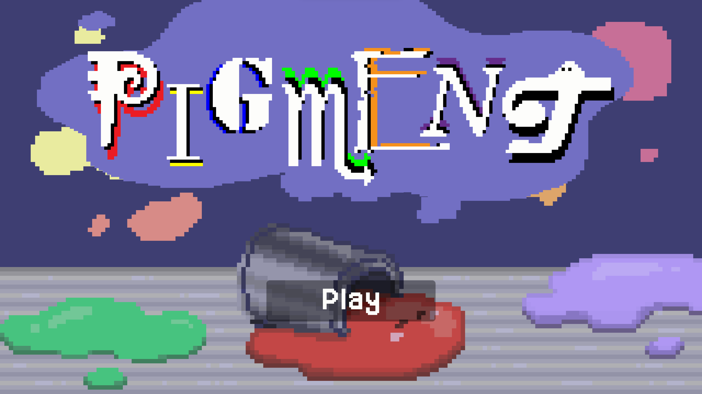
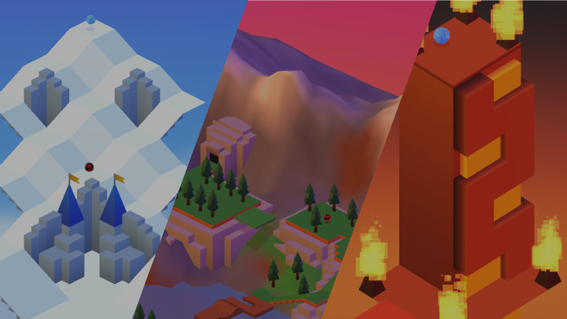
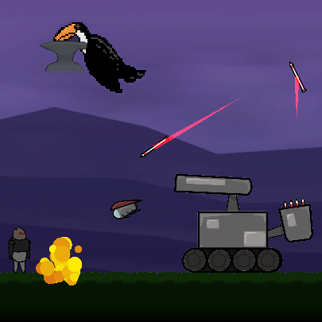
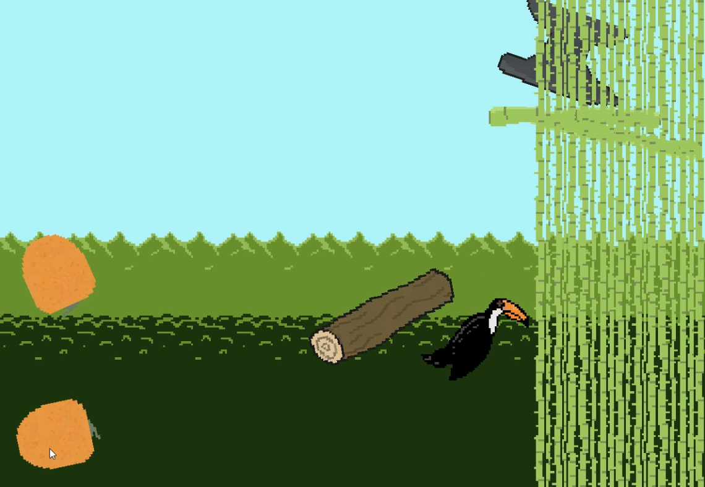

### About Me

  

    I'm a highly motivated and diligent high school senior with a concentration in computer science and media production. Skilled in identifying and addressing conflicts in areas ranging from technical programming, project design, and team leadership and collaboration. I
    honed these skills over 3+ years of experience in programming and game development. My short term goal is to attend an Ai focused computer science program at a college or university to earn my  bachelor’s degree in computer science. My long term goal is to apply my
    energy and knowledge of computer science and Ai to solve the world’s most pressing issues such as climate change, energy sustainability, healthcare, or national security. Although I haven’t yet decided which of these exact fields I will ultimately use my skills in,
    I am committed to making a meaningful impact in one of these areas.
  

### Skills

  
  
  
  
  
  
  
  
  

<h1>Projects:</h1>
<a href="https://github.com/Michael-1898/Game_Downloads">Download games here</a>
<h3>Pigment: Summer 2023</h3>

<h3>Marble Madness: Summer 2023</h3>
<a href="https://michael-1898.github.io/MarbleMadness_Remake/">Play the game in your browser</a>

<h3>Stoneclad: School Year 2022-2023</h3>
<a href="https://michael-1898.github.io/Stoneclad/">Play the game in your browser</a>

<h3>Toucan Game: Spring 2022</h3>
<a href="https://michael-1898.github.io/TheToucanGame/">Play the game in your browser</a>

<!--
**Michael-1898/Michael-1898** is a ✨ _special_ ✨ repository because its `README.md` (this file) appears on your GitHub profile.

Here are some ideas to get you started:

- 🔭 I’m currently working on ...
- 🌱 I’m currently learning ...
- 👯 I’m looking to collaborate on ...
- 🤔 I’m looking for help with ...
- 💬 Ask me about ...
- 📫 How to reach me: ...
- 😄 Pronouns: ...
- ⚡ Fun fact: ...
-->
